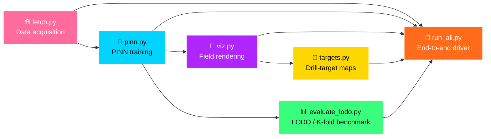

# 🜚 KORZHINSKII-Net

<div align="center">


### *A Physics-Informed Neural Network for Mineral Prospectivity Modelling in Russian Ore Provinces*

[](LICENSE)
[](https://www.python.org/)
[](https://pytorch.org/)
[](#)
[](#)

</div>

---

> *"Named after **Dmitri Sergeyevich Korzhinskii** (1899–1985) — founder of physico-chemical petrology and the theory of infiltration metasomatism, the physical scaffold this network is constrained by."*

<br>

## 🌋 Overview

**KORZHINSKII-Net** couples a **2D radial physics-informed neural network (PINN)** with lithology-aware reactive transport equations to predict subsurface mineralization potential $$M(x, z)$$.

The network jointly solves for:

| Symbol | Field | Governing physics |
|:------:|:------|:------------------|
| 🌡️ *T* | Temperature | Advection–diffusion heat transport |
| 💎 *P* | Pressure | Darcy flow |
| ⚗️ *C* | Metal concentration | Reaction-rate-limited solubility |

<br>

## 🗺️ Russian Ore Provinces Covered

<div align="center">

| 🏔️ Site | 💰 Commodity | 🌐 Tectonic setting |
|:--------|:-------------|:--------------------|
| 🔥 **Norilsk** | Ni–Cu–PGE | Siberian Traps |
| ❄️ **Pechenga** | Ni–Cu sulphide | Baltic Shield (Kola) |
| 🟠 **Udokan** | Cu (sandstone-hosted) | Aldan–Stanovoy |
| 🟡 **Sukhoi Log** | Au (orogenic) | Baikal–Patom belt |
| ✨ **Natalka** | Au (orogenic) | Yana–Kolyma |
| 💠 **Mirny** | Diamond (kimberlite) | Siberian craton |

</div>

Evaluated under **leave-one-deposit-out (LODO)** and **K-fold cross-validation** across **4 commodity classes**.

<br>

## ⚙️ Pipeline



<details>
<summary>📂 <b>Click to view module breakdown</b></summary>

<br>

| Module | Role |
|:-------|:-----|
| `fetch.py` | Pulls Macrostrat, OSM, USGS, NASA POWER |
| `pinn.py` | Trains PINN per site with proxy modulators |
| `viz.py` | Renders T, M, lithology cross-sections |
| `targets.py` | Generates geographic drill-target maps |
| `evaluate_lodo.py` | Benchmarks vs 7 ML baselines |
| `run_all.py` | End-to-end driver |

</details>

<br>

## 🚀 Quick Start

### 📦 Install

```bash
python -m venv venv && source venv/bin/activate
pip install torch numpy matplotlib scikit-learn requests
```

### ▶️ Run end-to-end

```bash
python run_all.py --epochs 2000
```

### 🧪 Run benchmark (LODO + 5-fold)

```bash
python evaluate_lodo.py \
    --sites all \
    --epochs 800 \
    --neg-mode hard \
    --r-inner 0.4 \
    --r-outer 2.0 \
    --kfold 5 \
    --tag fair_5fold_all
```

<br>

## 🧬 Method

The model approximates **three coupled fields** with a multi-head MLP:

$$
(T, P, C) = f_{\theta}(x, z)
$$

constrained by:

**🌊 Darcy flow**

$$
\mathbf{q} = -\frac{k}{\mu}\nabla P
$$

**🔥 Advection–diffusion heat transport**

$$
\rho c_p \mathbf{q} \cdot \nabla T = \nabla \cdot (\lambda \nabla T)
$$

**⚗️ Softplus-saturated reaction rate**

$$
R(T, C) = \mathrm{softplus}\big(\alpha\, k(T)\, [C - C_{\mathrm{eq}}(T, \ell)]\big)
$$

depending on **lithology-specific solubility** and **proxy modulators**:

- 🪨 Faults
- 📈 Seismicity
- 🔀 Lithological contacts
- 🌋 Deep intrusive roots

The mineralization field is the **prediction target**:

$$
\boxed{\; M(x, z) \;=\; R\big(T(x,z),\, C(x,z)\big) \;}
$$

<br>

## 📊 Baselines

<div align="center">

| 🏷️ Model | Description |
|:---------|:------------|
| 🟦 **PROXY** | $$M = k_{\mathrm{mod}}(x) \cdot s_z(z)$$ — no training |
| 🟥 **LR** | Logistic regression |
| 🟧 **RF** | Random forest |
| 🟨 **ET** | Extra trees |
| 🟩 **GB** | Gradient boosting |
| 🟪 **KNN** | k-nearest neighbors |
| 🟫 **SVM** | Support vector (RBF kernel) |
| ⬛ **MLP** | Multi-layer perceptron |

</div>

> All baselines use the **same CV folds** as the PINN, with **hard ring negatives** and **jittered positive z** to prevent leakage.

<br>

## 📁 Project Structure

```
KORZHINSKII-Net/
├── 🌐 fetch.py              # Data acquisition
├── 🧠 pinn.py               # PINN training
├── 🎨 viz.py                # Field rendering
├── 🎯 targets.py            # Drill-target generation
├── 📊 evaluate_lodo.py      # LODO + K-fold benchmark
├── 🚀 run_all.py            # End-to-end pipeline
├── 📦 data/                 # Cached site data
├── 🖼️  outputs/              # Figures + target maps
└── 📜 LICENSE
```

<br>

## 📝 Citation

If you use **KORZHINSKII-Net** in academic work, please cite:

```bibtex
@software{korzhinskii_net_2026,
  author = {Kriuk, Boris},
  title  = {KORZHINSKII-Net: a physics-informed neural network
            for mineral prospectivity modelling},
  year   = {2026},
  url    = {https://github.com/BorisKriuk/KORZHINSKII-Net}
}
```

<br>

## 📜 License

Released under the **Apache License 2.0** — see [`LICENSE`](LICENSE).

<br>

---

<div align="center">

### 🜚 *Built on the shoulders of Korzhinskii's metasomatic theory* 🜚


<sub>⭐ If this helped your research, consider starring the repo ⭐</sub>


</div>
